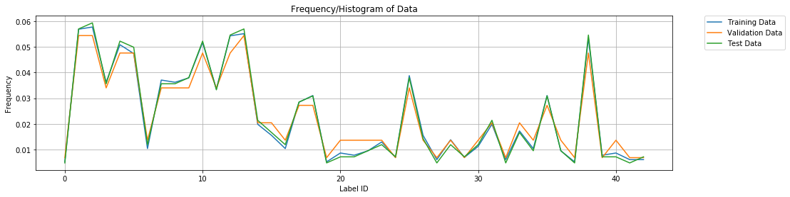
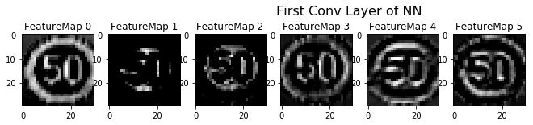
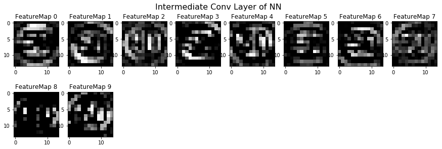
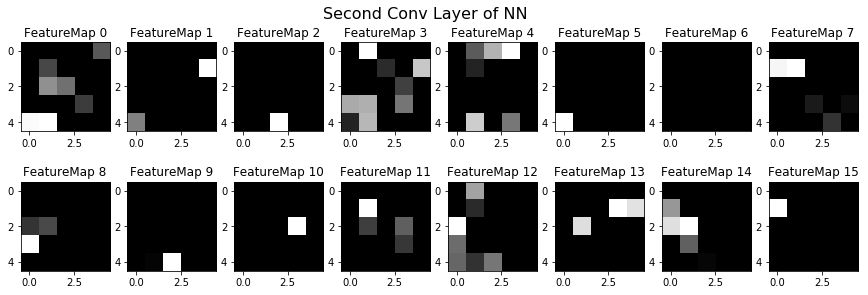

# **Traffic Sign Recognition** 

## Writeup

---

**Build a Traffic Sign Recognition Project**

The goals / steps of this project are the following:
* Load the data set (see below for links to the project data set)
* Explore, summarize and visualize the data set
* Preprocess the data to increase NN Accuracy
* Design, train and test a model architecture
* Use the model to make predictions on new images
* Analyze the softmax probabilities of the new images
* Analyze the images of hidden layers
* Summarize the results with a written report

---
## Step 0: Load The Data


```python
# Load pickled data
import pickle

# TODO: Fill this in based on where you saved the training and testing data

training_file = "../data/train.p"
validation_file="../data/valid.p"
testing_file = "../data/test.p"

with open(training_file, mode='rb') as f:
    train = pickle.load(f)
with open(validation_file, mode='rb') as f:
    valid = pickle.load(f)
with open(testing_file, mode='rb') as f:
    test = pickle.load(f)
    
X_train, y_train = train['features'], train['labels']
X_valid, y_valid = valid['features'], valid['labels']
X_test, y_test = test['features'], test['labels']
```

---

## Step 1: Dataset Summary & Exploration

1. Provide a basic summary of the data set. In the code, the analysis should be done using python, numpy and/or pandas methods rather than hardcoding results manually.

I used the numpy library to calculate summary statistics of the traffic
signs data set: 

### Provide a Basic Summary of the Data Set Using Python, Numpy and/or Pandas
- Number of training examples = 34799
- Number of testing examples = 12630
- Image data shape = (32, 32, 3)
- Number of classes = 43

### Include an exploratory visualization of the dataset

#### 1. Augmentation is required?
I analyze how many pictures pro traffic sing are given on the training, validation and testing data


```python
import matplotlib.pyplot as plt
import random
%matplotlib inline

#getting the information to plot from train, vaidation and testing data
values, counts = np.unique(y_train, return_counts=True)
values_v, counts_v = np.unique(y_valid, return_counts=True)
values_t, counts_t = np.unique(y_test, return_counts=True)

fig = plt.figure(figsize=(16, 4))
#plotting to compare how validation, training and testing data look like pro Traffic Sign
plt.plot(values,counts/len(y_train), label="Training Data")
plt.plot(values_v,counts_v/len(y_valid), label="Validation Data")
plt.plot(values_t,counts_t/len(y_test), label="Test Data")
plt.xlabel('Label ID')
plt.ylabel('Frequency')
plt.title('Frequency/Histogram of Data')
plt.legend(bbox_to_anchor=(1.05, 1), loc='upper left', borderaxespad=0.)
plt.grid(True)
plt.show()

fig.savefig('../writeup_info/histograms.png')
```





[image1]: ../writeup_info/histograms1.png "histograms"
![alt_text][image1]

Future Suggestions: It would be interesting to analyze the Accuracy of the NNCOnv per Label (tf.metrics.accuracy?), to see if more training data for certain class is needed. A leasy conclusion would be to said that each traffic sign should have the same amount of data, but it doens't depend only on amount but also on how valuable is the input data.  

#### 2. See ID and Traffic Sign
I print the id and corresponding name. Also, it is shown a suffle example of each traffic sign


```python
import pandas as pd
signs = pd.read_csv('signnames.csv')
signNames = signs.values[:,1]
signs.head(44)
```


<div>
<style scoped>
    .dataframe tbody tr th:only-of-type {
        vertical-align: middle;
    }

    .dataframe tbody tr th {
        vertical-align: top;
    }

    .dataframe thead th {
        text-align: right;
    }
</style>
<table border="1" class="dataframe">
  <thead>
    <tr style="text-align: right;">
      <th></th>
      <th>ClassId</th>
      <th>SignName</th>
    </tr>
  </thead>
  <tbody>
    <tr>
      <th>0</th>
      <td>0</td>
      <td>Speed limit (20km/h)</td>
    </tr>
    <tr>
      <th>1</th>
      <td>1</td>
      <td>Speed limit (30km/h)</td>
    </tr>
    <tr>
      <th>2</th>
      <td>2</td>
      <td>Speed limit (50km/h)</td>
    </tr>
    <tr>
      <th>3</th>
      <td>3</td>
      <td>Speed limit (60km/h)</td>
    </tr>
    <tr>
      <th>4</th>
      <td>4</td>
      <td>Speed limit (70km/h)</td>
    </tr>
    <tr>
      <th>5</th>
      <td>5</td>
      <td>Speed limit (80km/h)</td>
    </tr>
    <tr>
      <th>6</th>
      <td>6</td>
      <td>End of speed limit (80km/h)</td>
    </tr>
    <tr>
      <th>7</th>
      <td>7</td>
      <td>Speed limit (100km/h)</td>
    </tr>
    <tr>
      <th>8</th>
      <td>8</td>
      <td>Speed limit (120km/h)</td>
    </tr>
    <tr>
      <th>9</th>
      <td>9</td>
      <td>No passing</td>
    </tr>
    <tr>
      <th>10</th>
      <td>10</td>
      <td>No passing for vehicles over 3.5 metric tons</td>
    </tr>
    <tr>
      <th>11</th>
      <td>11</td>
      <td>Right-of-way at the next intersection</td>
    </tr>
    <tr>
      <th>12</th>
      <td>12</td>
      <td>Priority road</td>
    </tr>
    <tr>
      <th>13</th>
      <td>13</td>
      <td>Yield</td>
    </tr>
    <tr>
      <th>14</th>
      <td>14</td>
      <td>Stop</td>
    </tr>
    <tr>
      <th>15</th>
      <td>15</td>
      <td>No vehicles</td>
    </tr>
    <tr>
      <th>16</th>
      <td>16</td>
      <td>Vehicles over 3.5 metric tons prohibited</td>
    </tr>
    <tr>
      <th>17</th>
      <td>17</td>
      <td>No entry</td>
    </tr>
    <tr>
      <th>18</th>
      <td>18</td>
      <td>General caution</td>
    </tr>
    <tr>
      <th>19</th>
      <td>19</td>
      <td>Dangerous curve to the left</td>
    </tr>
    <tr>
      <th>20</th>
      <td>20</td>
      <td>Dangerous curve to the right</td>
    </tr>
    <tr>
      <th>21</th>
      <td>21</td>
      <td>Double curve</td>
    </tr>
    <tr>
      <th>22</th>
      <td>22</td>
      <td>Bumpy road</td>
    </tr>
    <tr>
      <th>23</th>
      <td>23</td>
      <td>Slippery road</td>
    </tr>
    <tr>
      <th>24</th>
      <td>24</td>
      <td>Road narrows on the right</td>
    </tr>
    <tr>
      <th>25</th>
      <td>25</td>
      <td>Road work</td>
    </tr>
    <tr>
      <th>26</th>
      <td>26</td>
      <td>Traffic signals</td>
    </tr>
    <tr>
      <th>27</th>
      <td>27</td>
      <td>Pedestrians</td>
    </tr>
    <tr>
      <th>28</th>
      <td>28</td>
      <td>Children crossing</td>
    </tr>
    <tr>
      <th>29</th>
      <td>29</td>
      <td>Bicycles crossing</td>
    </tr>
    <tr>
      <th>30</th>
      <td>30</td>
      <td>Beware of ice/snow</td>
    </tr>
    <tr>
      <th>31</th>
      <td>31</td>
      <td>Wild animals crossing</td>
    </tr>
    <tr>
      <th>32</th>
      <td>32</td>
      <td>End of all speed and passing limits</td>
    </tr>
    <tr>
      <th>33</th>
      <td>33</td>
      <td>Turn right ahead</td>
    </tr>
    <tr>
      <th>34</th>
      <td>34</td>
      <td>Turn left ahead</td>
    </tr>
    <tr>
      <th>35</th>
      <td>35</td>
      <td>Ahead only</td>
    </tr>
    <tr>
      <th>36</th>
      <td>36</td>
      <td>Go straight or right</td>
    </tr>
    <tr>
      <th>37</th>
      <td>37</td>
      <td>Go straight or left</td>
    </tr>
    <tr>
      <th>38</th>
      <td>38</td>
      <td>Keep right</td>
    </tr>
    <tr>
      <th>39</th>
      <td>39</td>
      <td>Keep left</td>
    </tr>
    <tr>
      <th>40</th>
      <td>40</td>
      <td>Roundabout mandatory</td>
    </tr>
    <tr>
      <th>41</th>
      <td>41</td>
      <td>End of no passing</td>
    </tr>
    <tr>
      <th>42</th>
      <td>42</td>
      <td>End of no passing by vehicles over 3.5 metric ...</td>
    </tr>
  </tbody>
</table>
</div>


[image2]: ../writeup_info/train_signs.png "train_signs"
![alt_text][image2]

----

## Step 2: Design and Test a Model Architecture


### Pre-process the Data Set (normalization, grayscale, etc.)

1. Reshape: I realized that most picture can be cutted a little more uniformerly. Because background misleads NN, it is only benefitial to crop pictures if still posible.

2. RGB to Grayscale: Pictures have different ilumination. To reduce ilumination effects, pictures are change to gray scale

3. Equalization: Now at grayscale, contrast is improved using equalization. This functions uses histogram information and increase contrast of gray pictures

4. Normalization/Standarization: Now, to improve performance of the NN, pictures are normalizes. NN Input should be 0 centered.
(Here, I didn't notice a difference between normalization and standarization, which is why I only used normalization)


```python
from sklearn.utils import shuffle
import cv2

### croppping figures
def reshape(img):
    #getting dimensiones, how much to cut
    (l_row, l_col,x)= img.shape
    row_crop = round(0.1*l_row)   #4
    col_crop = round(0.1*l_col)   #5
    #cutting
    img_cut = img[row_crop:-row_crop, col_crop:-col_crop, :] 
    #returning to 32x32 dimension
    img_cut = cv2.resize(img_cut, (32, 32))
    return img_cut

## from BGR to Gray
def to_grayscale(img): #output shape nxn  (array.dtype)
    output = cv2.cvtColor(img, cv2.COLOR_BGR2GRAY)
    return output

def normalize1(images):
    outputs = (images - images.mean()) / (np.max(images)- np.min(images))
    return outputs

#equalization
def histogram_equalize(img):#output shape nxn
    equ = cv2.equalizeHist(img)
    return equ
    
def preprocessing(X):
    #cut, grayscale, equalize, normalize
    X_cc = np.zeros(X.shape).astype('uint8')
    X_pp = np.zeros(X.shape[:-1]).astype('uint8')  #shape nxn
        
    for i in range(X.shape[0]):
        X_cc[i] = reshape(X[i])
        X_pp[i] = to_grayscale(X_cc[i])
        X_pp[i] = histogram_equalize(X_pp[i])
    
    X_pp= np.expand_dims(X_pp, axis=3) #shape nxnx1    
    X_pp = normalize1(X_pp)
    return X_pp

#Preprocess images to use for training. Also plotted to confirm can incongruence between preprocessing_plot and plot function
X_train_n = preprocessing(X_train)
X_valid_n =  preprocessing(X_valid)
X_test_n =  preprocessing(X_test)
```

Then, I plot each step from preprocessing. 

[image3]: ../writeup_info/preprocessing.png "preprocessing"
![alt_text][image3]

**Conclusions:** Normalization Effect doesnt modify, how I see the picture

### Model Architecture

My final model consisted of the following layers:

| Layer         		|     Description	        					| 
|:---------------------:|:---------------------------------------------:| 
| Input         		| 32x32x1 Preprocessed image   					| 
| Convolution 3x3     	| 1x1 stride, valid padding, outputs 30x30x6 	|
| RELU					|												|
| Convolution 3x3     	| 1x1 stride, valid padding, outputs 28x28x10 	|
| RELU					|												|
| Max pooling	      	| 2x2 stride,  outputs 14x14x10 				|
| Convolution 3x3	    | 1x1 stride, valid padding, outputs 10x10x16  	|
| RELU					|												|
| Max pooling	      	| 2x2 stride,  outputs 5x5x16  					|
| Dropout               | 0.5                                           |
| Flatten               |                                               |
| Fully connected		| 400 to 120       								|
| RELU					|												|
| Dropout               | 0.5                                           |
| Fully connected		| 120 to 84       								|
| RELU					|												|
| Dropout               | 0.5                                           |
| Fully connected		| 84 to 43       								|
 

####  It is similat to LeNet Structure, but with the following modifications:
1. I add three droput functions at the highest layer, to reduce the correlation between previous layers
2. I add a convolution layer after first convolution layer, in order to increase detection on the lowest layer of NN. 

Conv1: 
- 32x21x1 Input 
- 30x30x6 Output
- I change to a filter size of 3, to increase accuracy of the first layer

Conv12:
- 30x30x6 Input 
- 28x28x10 Output
- Extra filter of size 3 is running. Also depth of the filter is increase from 6 to 10

Polling 1:
- 28x28x10 Input 
- 14x14x10 Output
- Remains as before

Conv2:
- 14x14x10 Input 
- 10x10x16 Output
- Jump from 10 to 16 on the filter shorter as before (6 to 16)


```python
from tensorflow.contrib.layers import flatten

def LeNet6(x, keep_prob, keep_prob_soft):    
    # Arguments used for tf.truncated_normal, randomly defines variables for the weights and biases for each layer
    mu = 0
    sigma = 0.1
    
    # Layer 1: Convolutional. Input = 32x32x1. Output = 30x30x6.
    conv1_W = tf.Variable(tf.truncated_normal(shape=(3, 3, 1, 6), mean = mu, stddev = sigma))
    conv1_b = tf.Variable(tf.zeros(6))
    conv1   = tf.nn.conv2d(x, conv1_W, strides=[1, 1, 1, 1], padding='VALID') + conv1_b

    # Activation.
    conv1 = tf.nn.relu(conv1)
    #conv1    = tf.nn.dropout(conv1, keep_prob_soft)

    # EXTRA: Layer 12: Convolutional. Output = 28x28x10.
    conv12_W = tf.Variable(tf.truncated_normal(shape=(3, 3, 6, 10), mean = mu, stddev = sigma))
    conv12_b = tf.Variable(tf.zeros(10))
    conv12   = tf.nn.conv2d(conv1, conv12_W, strides=[1, 1, 1, 1], padding='VALID') + conv12_b
    
    # Activation.
    conv12 = tf.nn.relu(conv12)
    
    # Pooling. Input = 28x28x10. Output = 14x14x10.
    conv12 = tf.nn.max_pool(conv12, ksize=[1, 2, 2, 1], strides=[1, 2, 2, 1], padding='VALID')

    # Layer 2: Convolutional. Output = 10x10x16.
    conv2_W = tf.Variable(tf.truncated_normal(shape=(5, 5, 10, 16), mean = mu, stddev = sigma))
    conv2_b = tf.Variable(tf.zeros(16))
    conv2   = tf.nn.conv2d(conv12, conv2_W, strides=[1, 1, 1, 1], padding='VALID') + conv2_b
    
    # Activation.
    conv2 = tf.nn.relu(conv2)

    # Pooling. Input = 10x10x16. Output = 5x5x16.
    conv2 = tf.nn.max_pool(conv2, ksize=[1, 2, 2, 1], strides=[1, 2, 2, 1], padding='VALID')
    # EXTRA: Dropout
    conv2 = tf.nn.dropout(conv2, keep_prob)

    # Flatten. Input = 5x5x16. Output = 400.
    fc0   = flatten(conv2)
    
    # Layer 3: Fully Connected. Input = 400. Output = 120.
    fc1_W = tf.Variable(tf.truncated_normal(shape=(400, 120), mean = mu, stddev = sigma))
    fc1_b = tf.Variable(tf.zeros(120))
    fc1   = tf.matmul(fc0, fc1_W) + fc1_b
    
    # Activation.
    fc1    = tf.nn.relu(fc1)
    # EXTRA: Dropout
    fc1    = tf.nn.dropout(fc1, keep_prob)

    # Layer 4: Fully Connected. Input = 120. Output = 84.
    fc2_W  = tf.Variable(tf.truncated_normal(shape=(120, 84), mean = mu, stddev = sigma))
    fc2_b  = tf.Variable(tf.zeros(84))
    fc2    = tf.matmul(fc1, fc2_W) + fc2_b
    
    # Activation.
    fc2    = tf.nn.relu(fc2)
    # EXTRA: Dropout
    fc2    = tf.nn.dropout(fc2, keep_prob)

    # Layer 5: Fully Connected. Input = 84. Output = n_classes(43).
    fc3_W  = tf.Variable(tf.truncated_normal(shape=(84, n_classes), mean = mu, stddev = sigma))
    fc3_b  = tf.Variable(tf.zeros(n_classes))
    logits = tf.matmul(fc2, fc3_W) + fc3_b
    
    return logits, conv1, conv12, conv2

x = tf.placeholder(tf.float32, (None, 32, 32, 1))
y = tf.placeholder(tf.int32, (None))
one_hot_y = tf.one_hot(y, n_classes)
```

### Train, Validate and Test the Model

A validation set can be used to assess how well the model is performing. A low accuracy on the training and validation
sets imply underfitting. A high accuracy on the training set but low accuracy on the validation set implies overfitting.

#### 1.1 Training Pipeline

- Learning Rate: It is a factor to change weights. A lowest rate reduce weight changes, which is why it would need more time to train.
- Batch size: 128 pictures will be analyzed before actualizing weights. A bigger batch_size, it would modify weight slower.
- Epochs: It means how many times all training date will be used to train. Epochs should be long enough to reduce loss as much as possible. If it is too much, it can overfit.
- Keep_Prob: At droput, some weights are ignore. Keep_Prob represent in which procent these weights are dropped. It helps to jump away from fake best solutions, and increase robustness of NN. 

All these factor were tunned so that, they are not so high, not so low.


```python
import tensorflow as tf

EPOCHS = 200# 150 75 #80
BATCH_SIZE = 128
rate = 0.001
keep_prob = tf.placeholder(tf.float32, []) 
keep_prob_soft = tf.placeholder(tf.float32, []) 
```

To Update the weights and compute the loss (error), I would use cross entropy and AdamOptimazer


```python
logits, conv1, conv12, conv2 = LeNet6(x, keep_prob, keep_prob_soft)
cross_entropy = tf.nn.softmax_cross_entropy_with_logits(labels=one_hot_y, logits=logits)
loss_operation = tf.reduce_mean(cross_entropy)
optimizer = tf.train.AdamOptimizer(learning_rate = rate)
training_operation = optimizer.minimize(loss_operation)
```

#### 1.2 Model Evaluation


```python
#it get the index/position of the higgest probability and the right label and compare
correct_prediction = tf.equal(tf.argmax(logits, 1), tf.argmax(one_hot_y, 1))
accuracy_operation = tf.reduce_mean(tf.cast(correct_prediction, tf.float32))

#name where NN is save
saver = tf.train.Saver()

def evaluate(X_data_n, y_data):
    num_examples = len(X_data_n)
    total_loss = 0
    total_accuracy = 0
    sess = tf.get_default_session()
    for offset in range(0, num_examples, BATCH_SIZE):
        batch_x, batch_y = X_data_n[offset:offset+BATCH_SIZE], y_data[offset:offset+BATCH_SIZE]
        loss, accuracy = sess.run([accuracy_operation, loss_operation], feed_dict={x: batch_x, y: batch_y, keep_prob: 1, keep_prob_soft: 1})
        total_accuracy += (accuracy * len(batch_x))
        total_loss += (loss * len(batch_x))
    return total_accuracy / num_examples, total_loss / num_examples
```

#### 1.3 Train the Model
with tf.Session() as sess:
    sess.run(tf.global_variables_initializer())
    num_examples = len(X_train_n)
    
    #training and validation log
    validation_accuracy_log = []
    validation_loss_log = []
    
    print("Training...")
    print()
    for i in range(EPOCHS):
        X_train_n, y_train = shuffle(X_train_n, y_train)
        for offset in range(0, num_examples, BATCH_SIZE):
            end = offset + BATCH_SIZE
            batch_x, batch_y = X_train_n[offset:end], y_train[offset:end]
            sess.run(training_operation, feed_dict={x: batch_x, y: batch_y, keep_prob: 0.6, keep_prob_soft: 0.75})
            
        validation_loss, validation_accuracy = evaluate(X_valid_n, y_valid)
        print("EPOCH {} ...".format(i+1))
        print("Validation Accuracy = {:.3f}".format(validation_accuracy))
        print()
        
        #save information to plot later
        validation_loss_log.append(validation_loss)
        validation_accuracy_log.append(validation_accuracy)
        
    saver.save(sess, './lenet')
    print("Model saved")
    
#save log in a pickle
dist_pickle = {}
dist_pickle["loss"] = validation_loss_log
dist_pickle["accuracy"] = validation_accuracy_log
pickle.dump( dist_pickle, open( "log_information.p", "wb" ) )

```python
with tf.Session() as sess:
    saver.restore(sess, tf.train.latest_checkpoint('.'))

    test_loss,test_accuracy = evaluate(X_test_n, y_test)
    print("Test Accuracy = {:.3f}".format(test_accuracy))
```

    INFO:tensorflow:Restoring parameters from ./lenet
    Test Accuracy = 0.971


#### 1. 4 Total accuracy and loss curve 

[image4]: ../writeup_info/nn_curves.png "nn_curves"
![alt_text][image4]


#### 1. 5 Total Process and Comments

To increase the accuracy of the NN, I started improving different things in order:

0. I did a simple normalization of images and used BGR pictures for LeNet --> ~75% Test Accuracy
1. I tuned the learning_rate, batch_size and epochs to best possible answer --> ~80% Test Accuracy
2. I improved the preprocessing of the image, so that NN can get helpfully and better information --> 93% Test Accurracy
3. I added 2 Dropout Layer to LeNet with keep_prob of 0.75, 0.6 and 0.5 --> 95% Test Accurracy, with 0.5
4. I added an extra Convolutional Layer to NN Structure Modification --> 96% Test Accurracy
5. I put an extra Dropout Layer and increase Epochs number--> **97% Test Accurracy, 99% Validation Accuracy**

*During improving process, I was changing the number of Epochs.*

**[Future Suggestion]** *I also wanted to try with Batch Normalization, but I read that I should better use it for Keras. Since Keras is the next topic on my course, I decide to leave that idea for next project*


---

## Step 3: Test a Model on New Images


### Load and Output the Images
Here are 15 German traffic signs that I randomly found on the web, after cropping:

[image5]: ../writeup_info/my_signs.png "my_signs"
![alt_text][image5]

with id label:
y_test_own = [11,12,12,2,18,14,12,38,36,12,38,25,1,14,17]

I choose also pictures which were a little dirty and rotated.

### Predict the Sign Type for Each Image

After uploading the pictures and labels, I test the accuracy of my 15 pictures with my NN. 


```python
import tensorflow as tf
saver = tf.train.Saver()

#Preprocessing
X_test_own_n =  preprocessing(X_test_own)
```


```python
### Run the predictions here and use the model to output the prediction for each image.

def predict(X_data_n, y_data):
    sess = tf.get_default_session()
    #get the highest value of the logits
    prediction = tf.argmax(logits, 1)
    #run
    predictions = sess.run(prediction, feed_dict={x: X_data_n, y: y_data, keep_prob: 1, keep_prob_soft: 1})
    return predictions

with tf.Session() as sess:
    saver.restore(sess, tf.train.latest_checkpoint('.'))
    y_pred = predict(X_test_own_n, y_test_own)
    print(y_pred)
```

    INFO:tensorflow:Restoring parameters from ./lenet
    [11 12 12  2 18 14 12 38 36 12 38 25  1 14 17]


Here, you can see each picture, with each label and highest logits.

[image6]: ../writeup_info/my_sign_prediction.png "my_signs_p"
![alt_text][image6]

### Analyze Performance
**Accuracy was 100%**


```python
### Calculate the accuracy for these new images

with tf.Session() as sess:
    saver.restore(sess, tf.train.latest_checkpoint('.'))

    test_loss, test_accuracy = evaluate(X_test_own_n, y_test_own)
    print("Test Accuracy on my Images = {:.3f}".format(test_accuracy))
```

    INFO:tensorflow:Restoring parameters from ./lenet
    Test Accuracy on my Images = 1.000


### Output Top 5 Softmax Probabilities For Each Image Found on the Web

I will print out the top five softmax probabilities for the predictions on the German traffic sign images found on the web. Here I see that NN pretty much sure which was is the right answer. The Top 1 is mostly 99% sure, an the other 4 from Top5 have really low values (I had to plot in logarithm scale, to be able to observe also the other tops 4 in the bars graphic)

With my test images, the most misleading one, was the "General Caution" vs "Traffic Signal". It is too expected, because signs are similar and NN dont see the color of "Traffic Signal"


```python
#add a softmax function in prediction, so that the 10 output value pass through a softmax function
def predict_top5(X_data_n, y_data):
    sess = tf.get_default_session()
    #get the highest value of the logits
    softmax = tf.nn.softmax(logits)
    top5 = tf.nn.top_k(softmax, 5)
    #run
    predictions = sess.run(top5, feed_dict={x: X_data_n, y: y_data, keep_prob: 1, keep_prob_soft: 1})
    return predictions

with tf.Session() as sess:
    saver.restore(sess, tf.train.latest_checkpoint('.'))
    y_pred_t5 = predict_top5(X_test_own_n, y_test_own)
    #print(y_pred_t5.indices)
```

    INFO:tensorflow:Restoring parameters from ./lenet


[image7]: ../writeup_info/top5_0.png 
[image8]: ../writeup_info/top5_1.png
[image9]: ../writeup_info/top5_2.png
[image10]: ../writeup_info/top5_3.png
[image11]: ../writeup_info/top5_4.png
[image12]: ../writeup_info/top5_5.png
[image13]: ../writeup_info/top5_6.png
[image14]: ../writeup_info/top5_7.png
[image15]: ../writeup_info/top5_8.png
[image16]: ../writeup_info/top5_9.png
[image17]: ../writeup_info/top5_10.png
[image18]: ../writeup_info/top5_11.png
[image19]: ../writeup_info/top5_12.png
[image20]: ../writeup_info/top5_13.png
[image21]: ../writeup_info/top5_14.png


![alt_text][image7]
![alt_text][image8]
![alt_text][image9]
![alt_text][image11]
![alt_text][image12]
![alt_text][image13]
![alt_text][image14]
![alt_text][image15]
![alt_text][image16]
![alt_text][image17]
![alt_text][image18]
![alt_text][image19]
![alt_text][image20]
![alt_text][image21]


---

## Step 4 (Optional): Visualize the Neural Network's State with Test Images

**[DONE]** I have added a title on the output image from outputFeatureMap


```python
### Visualize your network's feature maps here.
### Feel free to use as many code cells as needed.

# image_input: the test image being fed into the network to produce the feature maps
# tf_activation: should be a tf variable name used during your training procedure that represents the calculated state of a specific weight layer
# activation_min/max: can be used to view the activation contrast in more detail, by default matplot sets min and max to the actual min and max values of the output
# plt_num: used to plot out multiple different weight feature map sets on the same block, just extend the plt number for each new feature map entry

def outputFeatureMap(image_input, tf_activation, title = "Conv Layer", activation_min=-1, activation_max=-1 ,plt_num=1):
    # Here make sure to preprocess your image_input in a way your network expects
    # with size, normalization, ect if needed
    # image_input =
    # Note: x should be the same name as your network's tensorflow data placeholder variable
    # If you get an error tf_activation is not defined it may be having trouble accessing the variable from inside a function
    activation = tf_activation.eval(session=sess,feed_dict={x : image_input,keep_prob: 1, keep_prob_soft: 1})
    featuremaps = activation.shape[3]
    fig = plt.figure(plt_num, figsize=(15,15))
    plt.suptitle(title, y = 0.9, fontsize=16)
    for featuremap in range(featuremaps):
        plt.subplot(6,8, featuremap+1) # sets the number of feature maps to show on each row and column
        plt.title('FeatureMap ' + str(featuremap)) # displays the feature map number
        if activation_min != -1 & activation_max != -1:
            plt.imshow(activation[0,:,:, featuremap], interpolation="nearest", vmin =activation_min, vmax=activation_max, cmap="gray")
        elif activation_max != -1:
            plt.imshow(activation[0,:,:, featuremap], interpolation="nearest", vmax=activation_max, cmap="gray")
        elif activation_min !=-1:
            plt.imshow(activation[0,:,:, featuremap], interpolation="nearest", vmin=activation_min, cmap="gray")
        else:
            plt.imshow(activation[0,:,:, featuremap], interpolation="nearest", cmap="gray")
    
    fig.savefig('../writeup_info/conv_output' + str(plt_num) + '.png')       
        
```


```python
#choosing one picture and adjusting to right dimensions
img = X_test_own_n[3]
img = np.expand_dims(img, axis=0)
print(img.shape)
```

    (1, 32, 32, 1)


```python
with tf.Session() as sess:
    saver.restore(sess, tf.train.latest_checkpoint('.'))

    outputFeatureMap(img, conv1,title ="First Conv Layer of NN" , plt_num=1)  
    outputFeatureMap(img, conv12,title ="Intermediate Conv Layer of NN", plt_num=2)
    outputFeatureMap(img, conv2,title ="Second Conv Layer of NN", plt_num=3)

```

    INFO:tensorflow:Restoring parameters from ./lenet











#### Observations:
**Layer 1:**
Layer is able to see the number 50 and the circle form. It should be looking and edges of the image.

**Layer 12:**
It is rather hard to determine what the network is focusing on in layer 12, but it seems to be mixing the information from  circle with the number information

**Layer 2:**
I can not decipher anymore what NN is looking at


```python

```
